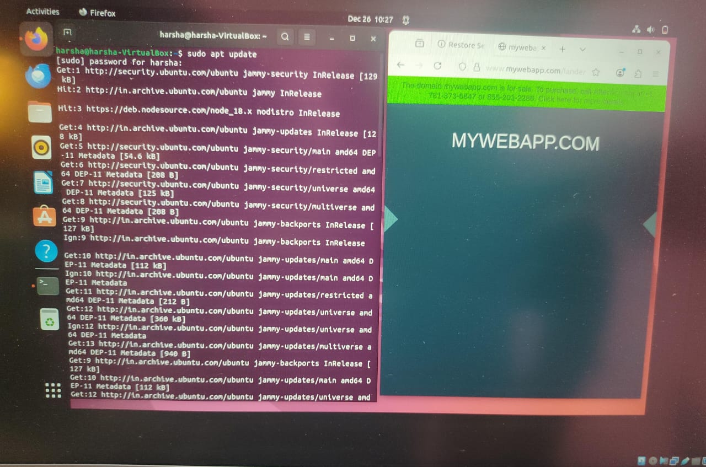
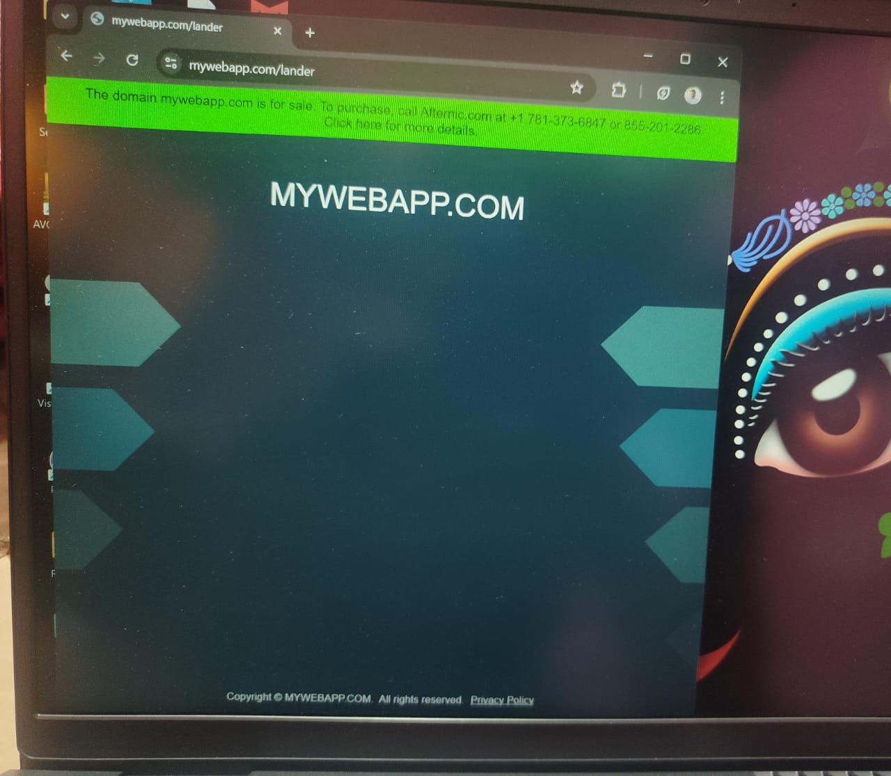
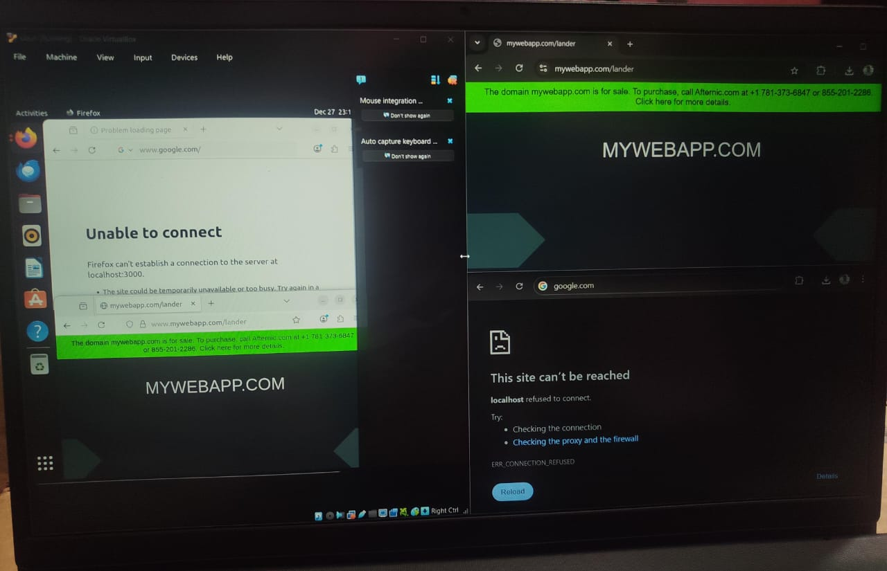

# Private DNS Server using BIND9

This project demonstrates a private authoritative DNS server configured using BIND9.
It resolves only a custom domain and blocks public internet DNS resolution.
The setup proves complete control over DNS without running any web server.

## Objective

To design and configure a private authoritative DNS server using BIND9
that resolves only a custom domain and operates independently from
public internet DNS services.

## Tools & Environment

- Ubuntu Linux (Virtual Machine)
- BIND9 DNS Server
- Windows OS (DNS client)
- VirtualBox / VMware
- dig command-line tool

## Architecture Overview

The Windows client is manually configured to use the Ubuntu VM as its DNS server.
All DNS queries are sent directly to the private BIND9 server.
Only the configured domain is resolved, while public internet domains are blocked.

## Screenshots

## Security Relevance
This setup is similar to internal DNS used in enterprises
to isolate private services from the public internet.

## Conclusion
The project successfully demonstrates private DNS ownership and isolation.
